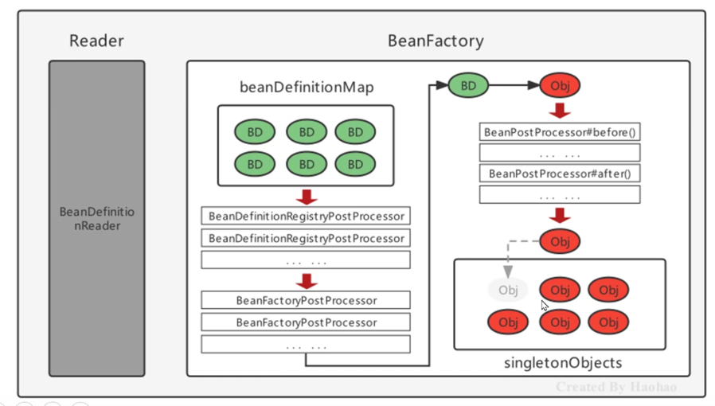
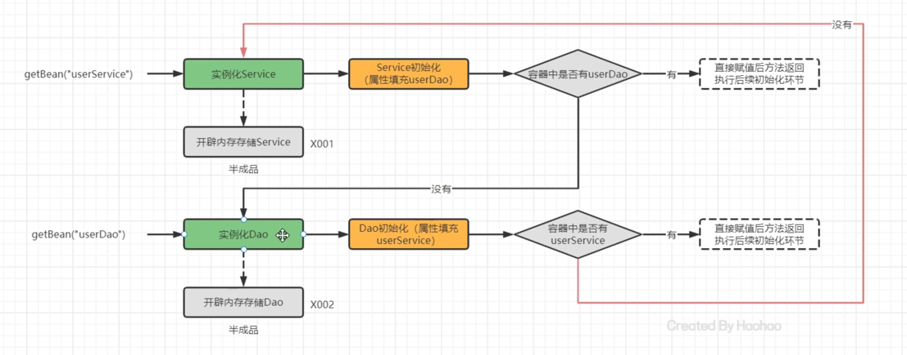
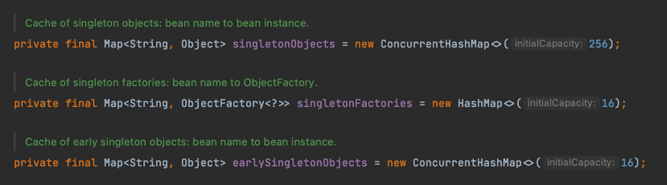
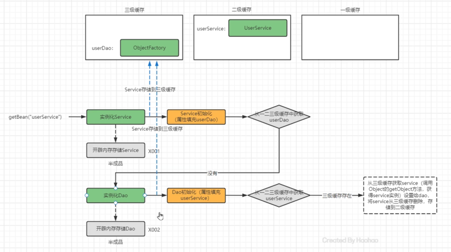
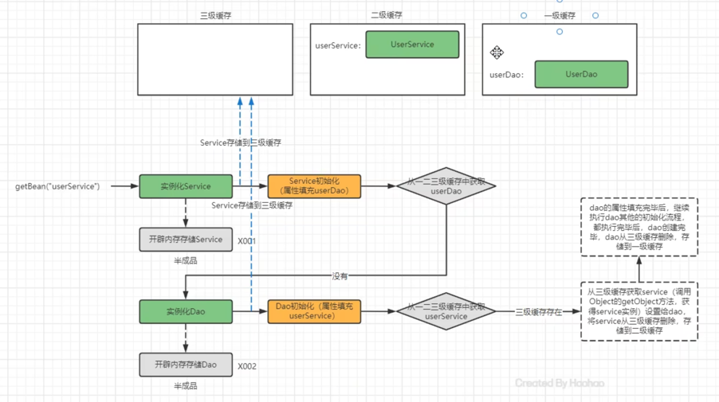
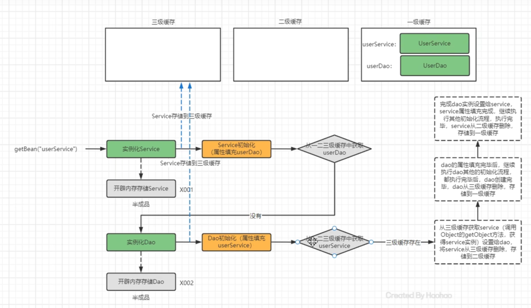
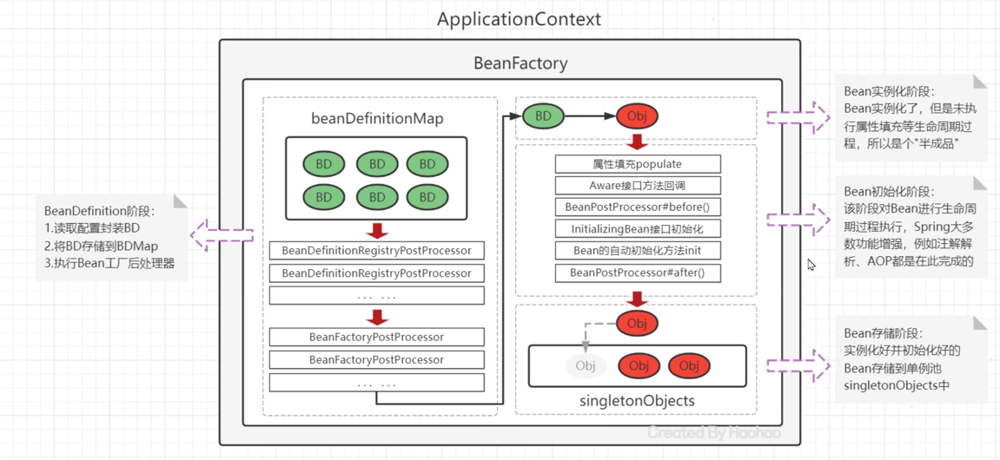

## Bean的实例化配置
- Spring实例化方式有两种
    - 构造方式实例化:底层通过构造方式对Bean进行实例化
    - 工厂方式实例化:底层通过调用自定义的工厂对Bean进行实例化
        - 静态工厂方法
        - 实例工厂方法
        - 实现FactoryBean规范延迟实例化Bean
            - 真正在使用的时候调用getObject进行实例化创建
          
- Bean的注入方式
    - 通过set方法注入
      <property name="userDao" ref="userDao" />
    - 通过构造Bean注入
    
- Bean 加载落流程
    - 加载xml配置文件，解析获取一个一个的bean信息，封装成一个一个的BeanDefinition对象
    - 将BeanDefinition对象把存在一个名为BeanDefinitionMap的Map中
    - Application遍历BeanDefinitionMap创建bean的实例对象
    - 创建好对象后，保存在singleObject的Map中
    - 当执行getBean时候返回
    
- Spring 后处理器
    - BeanFactoryPostProcessor: Bean工厂后处理器，在BeanDefinitionMap填充之后，Bean实例化之前调用
    - BeanPostProcessor: Bean对象后处理器, Bean实例化之后，到最终放入单例池之前，中间经过
    

- Spring bean 生命周期
    Spring bean的生命周期是从bean实例化之后，到Bean成为一个完整对象，最终存储在单例池中
    
    - 初始化阶段:Spring框架拿出BeanDefinition的信息判断是否是singleton，是否是延迟架子，
    是否是FactoryBean，最终将普通的singleton的Bean进行实例化
      
    - Bean的初始化阶段：Bean创建后仅仅是半成品，还需要对属性进行填充，执行接口方法，执行BeanPostProcess，
    执行UnitializingBean接口的初始化方法，执行自定义的init方法。这个阶段是Spring最复杂的一个部分，Aop增强、
      Spring注解功能等。
      
    - 完成阶段:经过初始化阶段，Bean成为一个完整的Spring Bean，被保存在单例池中。
    
- Spring的初始化过程
    - Bean实例的属性填充
    - Aware接口属性注入
    - BeanPostProcess的before接口
    - InitializingBean的初始化方法
    - 自定义接口init接口回调
    - BeanPostProcess的after接口
    
- 初始化过程
    
    - Bean的属性填充
        - BeanDefinition中有对当前Bean实体的注入信息属性PropertyValues进行存储
        
    - 注入时候，分为一下几种情况
        - 注入普通属性，直接通过set方法反射
        - 注入单项对象引用属性，从容器中取出，如果没有就去创建
        - 循环引用引用属性
            - 三级缓存
            Spring提供三级缓存，存储完整的Bean实例以及半成品，用于解决循环引用问题
              
              singletonObjects 存储完整Bean，单例池
              earlySingletonObjects 存储Bean半成品，缓存半成品对象，创建之后已经被引用
              singletonFactories 单例bean的工厂池，缓存半成品对象，使用时候通过工厂创建bean，创建之后未被引用
              查询顺序为三级(未被引用)->二级(引用)->一级
              
            
            
            
          
    - Aware接口
        底层库进行适配以及注入使用
        - servletContextAware
        - BeanFactoryAware
        - BeanNameAware
        
      

- Spring整合MyBatis
    整个包里面提供一个SqlSessionFactoryBean和一个扫描mapper的配置对象，SqlSessionFactoryBean一旦被实例化，
  就开始扫描Mapper并通过动态代理生成Mapper的实现类存储到Spring中。相关有四个类：
  - SqlSessionFactoryBean： 用于提供SqlSessionFactory
  - MapperScannerConfigurer：需要进行配置，用于扫面mapper
  - MapperFactoryBean：Mapper的FactoryBean，获取Mapper时候调用getObject
  -  

